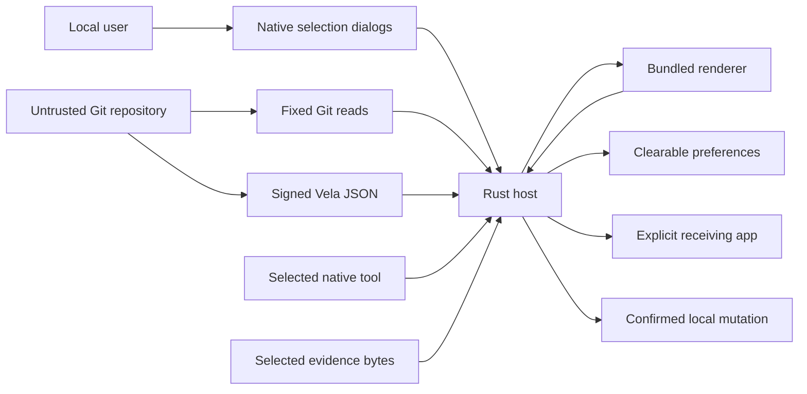

# Vela Workbench Tranche 2 threat model (historical)

Superseded for the current runtime by `vela-workbench-tranche3-appsec-threat-model.md` and the frozen pre-implementation contract in `vela-workbench-tranche3-threat-model.md`.

## Executive summary

The highest risks are executing substituted native tools, letting untrusted repository data become arbitrary argv or filesystem access, exporting different bytes than the user reviewed, and importing a Submission against stale source or Artifact bytes. The contract limits privilege to fixed profiles and argv, canonical selected roots, native-selected destinations, digest-bound bounded bytes, repeated preconditions, process-group cancellation, pinned Vela JSON, and OS-native confirmation immediately before each mutation. Residual risk is primarily same-user filesystem TOCTOU and the behavior of explicitly selected native tools, Git, signed Vela, and receiving applications.

## Scope and assumptions

In scope: `src-tauri/src`, `src-tauri/capabilities`, `src-tauri/permissions`, `src-tauri/tauri.conf.json`, `src/lib/workbench.ts`, generated renderer DTOs, preferences, and the packaged macOS app. Worktree creation, NativeExec, evidence capture/export, and Submission v3 intake are the new privileged paths. Build locks and tests are in scope as supply-chain and verification controls.

Assumptions validated by the governing handoff:

- Single-user local macOS desktop use; no server, remote WebView, multi-tenancy, or inbound network surface.
- Selected repositories and Git metadata are untrusted input and may contain private material.
- The bundled renderer is less trusted than Rust; it receives validated DTOs only.
- Signed Vela v0.977.3 and system Git are trusted only within fixed command surfaces. A user-selected native tool is intentionally executable but receives only the reviewed profile argv and cleared environment.
- Compromise of the same macOS user account and mutations made after explicit handoff are outside the app isolation guarantee.

Out of scope: Core release production, Verification, Decision, authority actions, provider mutation, Linux/BSD packaging, provider applications, editor/terminal behavior after handoff, and public Problems/Web services. No open service-context question currently changes the ranking.

## System model

### Primary components

- Bundled React renderer: repository switcher and Orient → Execute → Capture → Review draft UI (`src/App.tsx`).
- Tauri ACL/IPC: one local window capability with only enumerated custom commands (`src-tauri/capabilities/main.json`, `src-tauri/permissions/workbench.toml`).
- Rust command layer: canonical recent gating, preview/revalidation, native confirmations, ephemeral active/completed-run state, and exact cross-checks (`src-tauri/src/commands/mod.rs`).
- Privileged ports: bounded/cancellable processes, fixed Git reads plus detached worktree creation, reviewed native profiles, bounded evidence, pinned Vela JSON/Submission intake, Entire reference detection, and fixed handoff (`src-tauri/src/ports`).
- Rust-owned preferences: one mode-0600, deny-unknown-fields JSON file (`src-tauri/src/preferences.rs`).

### Data flows and trust boundaries

- User → native dialogs → Rust: selected local paths; OS-native UI; canonicalization, type and executable-mode checks.
- Renderer → Tauri IPC → Rust: nineteen typed invocations; bundled-local origin and explicit capability; Rust revalidates paths and enums.
- Untrusted repository → fixed Git/Vela/native processes → Rust: Git metadata, Vela JSON, and command bytes over bounded pipes; fixed argv, cleared environment, timeout/cancellation, schema and semantic validation.
- User → native destination/file selection → Rust: one empty worktree destination, evidence file, signed envelope, native tool, or export destination; canonicalization, containment, regular-file/type and digest checks.
- Rust → renderer: generated private DTOs; remote credentials are removed and raw JSON/files never cross.
- Rust → local filesystem/Git/Vela: one previewed detached worktree, create-new export, or pending Submission transaction; repeated preconditions and OS-native confirmation.
- Rust → receiving app: canonical path or sanitized HTTPS URL via bounded `/usr/bin/open`; requires an explicit user click.
- Rust ↔ preferences file: clearable canonical recents/tool choice only; local filesystem with mode 0600 and atomic replacement.

#### Diagram

## Assets and security objectives

| Asset | Why it matters | Security objective (C/I/A) |
| --- | --- | --- |
| Private repository files and paths | May contain unpublished evidence or data | C, I |
| Git refs, index, worktrees, commits and trees | Source provenance must remain sovereign and unchanged | I, A |
| Vela objects and scientific state | Incorrect interpretation can misstate accepted/current work | I |
| Signer credentials and ambient secrets | Tranche 1 must never consume or disclose them | C, I |
| Selected Vela executable identity | An impostor would execute with local user privilege | I |
| Renderer IPC capability | Expansion could create generic local privilege | I |
| Native tool identity and command profile | Substitution or argv expansion could execute attacker code with ambient access | C, I, A |
| Captured/exported exact bytes | Wrong, stale, or unredacted evidence can disclose private data or poison provenance | C, I |
| Submission draft/envelope and signer custody | A wrong import can create durable pending scientific state or misuse producer identity | C, I |
| Preferences | Reveal local paths but must be clearable and non-authoritative | C, I |
| Packaged app and lockfiles | Define the reviewed executable boundary | I, A |

## Attacker model

### Capabilities

- Controls files and Git configuration inside a selected repository, including remotes and separate-Git-dir metadata.
- Supplies malformed, oversized, slow, or semantically inconsistent subprocess output.
- Persuades the user to select an arbitrary local executable or repository symlink.
- Causes a concurrent ordinary repository change during observation.
- Injects content rendered as labels, assertions, paths, or remote locators.
- Supplies a malicious but explicitly selected native executable, command manifest marker, evidence file, or signed Submission envelope.
- Races a preview by changing a ref, executable, evidence file, destination, or working tree before confirmation.

### Non-capabilities

- No remote request path, account/session surface, hosted authority, or renderer remote content exists.
- The attacker does not already control the macOS user, app memory, system Git, or the exact signed Vela binary.
- The attacker cannot invoke non-enumerated Tauri commands, choose arbitrary argv/environment, upload bytes, or reach Verification/Decision through the declared capability.

## Entry points and attack surfaces

| Surface | How reached | Trust boundary | Notes | Evidence |
| --- | --- | --- | --- | --- |
| Repository selection | Native folder dialog | user path → Rust | Canonical root must contain selection | `commands/mod.rs::select_repository`; `ports/git.rs::inspect` |
| Vela selection | Native file dialog | executable path → Rust process | Hash is checked before any execution and after identity/version commands | `commands/mod.rs::select_vela_binary`; `ports/vela.rs::inspect_binary` |
| Private IPC | Bundled renderer | WebView → privileged Rust | Nineteen typed commands, local main window only | `src/lib/workbench.ts`; `capabilities/main.json` |
| Git output | Fixed `/usr/bin/git` reads | repository config/output → Rust parser | Hooks, fsmonitor and optional locks disabled | `ports/git.rs::run_git` |
| Vela JSON | Pinned signed binary | repository/JSON → Rust parser | Supported schema, envelope and semantic invariants | `ports/vela.rs::parse_envelope` and validators |
| Process pipes | Git, Vela, `open` | child process → host | Bounded bytes, timeout, group termination | `ports/process.rs::run_bounded` |
| Forge remote | Explicit Forge click | Git remote → browser | Credential redaction, HTTPS only, no query/fragment | `ports/git.rs::redact_remote_url`; `ports/launch.rs::https_remote` |
| Preferences | Selection/clear commands | Rust → app data | Deny unknown fields, 0600, clearable | `preferences.rs::PreferencesStore` |
| Worktree preview/create | Explicit UI and native destination | renderer/repository → Git mutation | fixed detached argv, resolved commit, repeated preconditions, native confirmation | `commands/mod.rs`; `ports/git.rs` |
| Native command profile | Explicit tool selection and Run | renderer/repository/tool → child process | fixed profile/argv, executable digest, cleared environment, caps, cancellation | `ports/native_exec.rs`; `ports/process.rs` |
| Evidence file/output | Native selection or completed run | local bytes → Rust/renderer/export | regular contained file, byte cap, exact digest/base64, create-new export, confirmation | `ports/evidence.rs`; `commands/mod.rs` |
| Submission draft/import | Review draft and native confirmation | renderer/envelope → pinned Vela mutation | closed typed input, Artifact rehash, source binding, exact CLI, result invariants | `ports/vela.rs`; `commands/mod.rs` |

## Top abuse paths

1. Goal: execute malicious local code. User selects an impostor Vela file → host hashes it before execution → mismatch is refused → no code runs.
2. Goal: inspect an unrelated private repository. Crafted `.git` redirects `core.worktree` → reported root lies outside selected directory → containment check refuses before snapshot/persistence.
3. Goal: hang Workbench. Child spawns a pipe-holding descendant → isolated process group is killed before reader joins → bounded command returns.
4. Goal: pair Vela state with the wrong source. Repository HEAD changes during Vela inspection → status commit/tree or second Git snapshot disagrees → entire observation fails closed.
5. Goal: exfiltrate a token to the renderer/browser. Remote embeds userinfo/query/fragment → Git DTO redacts it → handoff accepts only sanitized HTTPS.
6. Goal: reach ambient credentials. Subprocess requests inherit the desktop environment → host clears it and restores only a minimal allowlist/PATH → signer and credential variables are absent.
7. Goal: mutate sovereign source during inspection. Git/Vela read set runs → byte-preservation gate compares full before/after manifest → any mutation fails the gate.
8. Goal: execute code during worktree checkout. The target tree assigns a Git filter backed by repository config → Rust checks effective target attributes and refuses every assigned `filter` before `worktree add` → smudge/process code never starts.
9. Goal: smuggle arbitrary argv. Repository labels/profile data contain flags → Rust maps only a closed profile enum to fixed OS argv → unexpected values fail before spawn.
10. Goal: substitute a tool or evidence after preview. Attacker replaces the path → Rust rehashes before action and compares the exact preview digest/source revision → action is refused as stale.
11. Goal: export private or altered bytes silently. Renderer requests an arbitrary destination/source → Rust accepts only a native-selected destination and captured source, shows digest/size/redaction state in native confirmation, refuses overwrite, and verifies post-write bytes.
12. Goal: turn producer action into acceptance. Draft/import invokes Vela → Rust accepts only `submit`, validates `accepted_event_delta = 0` and `accepted_state_changed = false`, and exposes no Verification or Decision command.

## Threat model table

| Threat ID | Threat source | Prerequisites | Threat action | Impact | Impacted assets | Existing controls (evidence) | Gaps | Recommended mitigations | Detection ideas | Likelihood | Impact severity | Priority |
| --- | --- | --- | --- | --- | --- | --- | --- | --- | --- | --- | --- | --- |
| TM-001 | Selected executable | User chooses attacker file | Masquerade as Vela and execute | Local code execution | repositories, secrets, scientific state | hash-before-exec and canonical identity (`ports/vela.rs`) | Same-user path race remains | Consider kernel-backed immutable execution handle if threat scope expands | Record only refusal kind/hash prefix locally | low | high | medium |
| TM-002 | Repository Git config | User selects crafted decoy | Redirect worktree outside selection | Private path disclosure, wrong source | repositories, provenance | canonical ancestor check and hostile test (`ports/git.rs`) | Same-user path race | Retain exact selected/root check on every command | Surface root refusal without unrelated path contents | low | high | medium |
| TM-003 | Child process | Trusted tool compromised or malformed repo triggers helper | Hold pipes or emit excessive output | App hang/resource use | availability | byte caps, deadlines, process groups (`ports/process.rs`) | Kernel kill failure is not separately surfaced | Keep caps small and treat kill failures as residual platform fault | Count local timeout/refusal categories without content | low | medium | low |
| TM-004 | Concurrent local writer | Repository changes during inspect | Mix Git and Vela snapshots | Misleading exactness | source/scientific integrity | Vela status commit/tree check plus repeated identical Git snapshot (`commands/mod.rs`) | Native integration revision is manifest-declared, not HEAD | Preserve double-snapshot rule and display both values | Display exact observation timestamp and refresh refusal | medium | medium | medium |
| TM-005 | Malicious remote metadata | Attacker controls Git remote | Embed credentials or unsafe URL | Secret exposure/navigation | repository paths, tokens | DTO redaction; HTTPS-only sanitized handoff (`git.rs`, `launch.rs`) | Arbitrary HTTPS host is allowed | Keep explicit click and show destination owner; consider host policy only if required | Return destination in handoff receipt | low | medium | low |
| TM-006 | Compromised bundled renderer | XSS/dependency compromise | Invoke privileged host surface | Local data access/handoff | all local assets | restrictive CSP and enumerated-command local ACL (`tauri.conf.json`, capability) | `style-src unsafe-inline` supports Base UI positioning | Remove inline style allowance if Base UI no longer needs it; preserve no remote content | Package diff of capabilities/CSP in every gate | low | high | medium |
| TM-007 | Preferences race | Same-user local attacker | Replace temporary preference path | Alter recents/tool choice | preferences | mode 0600, deny unknown fields, canonical revalidation | Same-user temp-symlink TOCTOU | Use directory-relative no-follow atomic file APIs if same-user attack enters scope | Refuse malformed preferences | low | low | low |
| TM-008 | Malicious repository/profile | User opens crafted repository | Turn profile text into executable/argv/environment | Local code execution or secret exposure | repositories, secrets, availability | closed profile enum, fixed argv and cleared environment (`ports/native_exec.rs`, `ports/process.rs`) | Selected tool itself is trusted for that run | Show exact tool digest/argv/env and require explicit Run; never add free-form args | Surface profile refusal and exact executable identity | medium | high | high |
| TM-009 | Same-user race | Valid preview exists | Replace tool, evidence, ref, or destination before apply | Execute/export/import different bytes | provenance, private evidence, source | repeated canonicalization, digest and source/ref preconditions; native confirmation (`commands/mod.rs`) | Kernel-backed immutable handles are absent | Hash before/after and fail stale; keep preview lifetime one action | Return stale/refusal category without file content | low | high | medium |
| TM-010 | Malicious command process | Reviewed profile launches compromised tool | Emit endless data, fork descendants, ignore cancellation | Resource exhaustion, retained background process | availability, private environment | one active run, cleared env, output/time caps, process group kill (`ports/process.rs`) | OS kill/wait failures remain | Poll cancellation promptly; never detach; delete ephemeral output on clear/exit | Show cancelled/timeout distinct from failed | low | high | medium |
| TM-011 | Evidence/export confusion | Renderer or user selects wrong item | Export stale, unredacted, or substituted bytes | Private-data disclosure, false evidence | evidence bytes, provenance | explicit item, digest/size/exclusions, native destination, create-new, rehash, confirmation (`ports/evidence.rs`) | User may approve genuinely sensitive bytes | Require explicit redaction confirmation and show exact bytes/base64 before export | Receipt contains destination and final digest only | medium | high | high |
| TM-012 | Submission draft/envelope | Malicious input or stale repository | Import wrong Artifacts/producer request or reach authority action | Durable false pending record or identity misuse | scientific state, signer custody | pinned Vela hash, typed closed input, exact argv, Artifact/source recheck, native confirmation, submit-result invariants (`ports/vela.rs`) | Core author command accesses local agent key under HOME by design | Keep explicit producer, Repository authority separation; compile no verification/decision command | Show operation/submission/proposal roots and zero authority effect | medium | high | high |
| TM-013 | Capability drift | Future developer | Add generic fs/shell/http or Tranche 3 command | Broad local privilege or authority mutation | all assets | exact ACL/CSP and deletion scans (`capabilities/main.json`, tests) | Review discipline required | Snapshot capability names and forbidden dependency/symbol scans in gates | Treat any ACL/CSP diff as security-review blocking | low | high | medium |

## Criticality calibration

- Critical: unauthenticated remote code execution, automatic authority-signer use, or silent Verification/Decision/Standing mutation. No such surface exists.
- High: arbitrary repository-controlled argv/environment, export of unreviewed private bytes, substituted executable/evidence, or Submission mutation without explicit confirmation.
- Medium: user-assisted privilege crossing, wrong-source scientific interpretation, persistent app hang, stale preview refusal failure, or renderer capability expansion.
- Low: local path disclosure without transmission, explicit navigation to an arbitrary HTTPS forge, or preference-only integrity loss.

## Focus paths for security review

| Path | Why it matters | Related Threat IDs |
| --- | --- | --- |
| `src-tauri/src/ports/vela.rs` | Executable identity, JSON parsing and scientific invariants | TM-001, TM-004 |
| `src-tauri/src/ports/git.rs` | Root containment, read-only Git argv, remote redaction | TM-002, TM-005 |
| `src-tauri/src/ports/process.rs` | Environment, output caps, timeouts and descendant termination | TM-001, TM-003 |
| `src-tauri/src/commands/mod.rs` | Selected-recent authorization and exact snapshot binding | TM-002, TM-004 |
| `src-tauri/src/ports/launch.rs` | Local path and external HTTPS handoff | TM-005 |
| `src-tauri/src/preferences.rs` | Only persistent local state and deletion boundary | TM-007 |
| `src-tauri/src/ports/native_exec.rs` | Closed executable profiles, tool identity, argv and environment | TM-008, TM-009, TM-010 |
| `src-tauri/src/ports/evidence.rs` | Exact bounded file/output bytes and one-shot export | TM-009, TM-011 |
| `src-tauri/capabilities/main.json` | Renderer privilege enumeration | TM-006 |
| `src-tauri/permissions/workbench.toml` | Exact custom command allowlist | TM-006 |
| `src-tauri/tauri.conf.json` | CSP, local bundle and window boundary | TM-006 |
| `src/contracts/generated/ipc.ts` | Renderer receives generated DTOs only | TM-005, TM-006 |

## Notes on use

This model covers every planned Tranche 2 entry point and each trust boundary, and separates runtime from build/test utilities. The user-provided deployment, sensitivity, authority, and non-goal context is reflected above. Re-rank all high risks if the app becomes multi-user, receives remote content, exposes IPC beyond the bundled window, permits repository-defined argv, or adds Verification/Decision in a later tranche.
