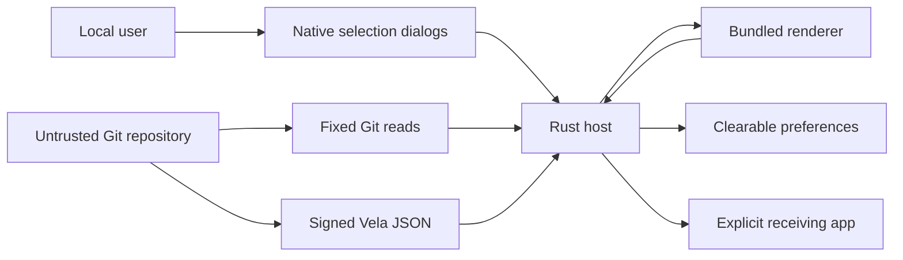

# Vela Workbench Tranche 1 threat model

## Executive summary

The highest risks are local privilege crossing from untrusted repository metadata or an unverified executable into the Rust host, and loss of exactness when Git and Vela observations race. The candidate mitigates these with hash-before-execution, canonical selected-root containment, fixed argv-only commands, schema and semantic validation, repeated Git observation, bounded process groups, renderer-safe DTOs, and a six-command local Tauri capability. Residual risk is primarily same-user filesystem TOCTOU and the behavior of trusted Git, signed Vela, and explicitly launched receiving applications.

## Scope and assumptions

In scope: `src-tauri/src`, `src-tauri/capabilities`, `src-tauri/permissions`, `src-tauri/tauri.conf.json`, `src/lib/workbench.ts`, generated renderer DTOs, preferences, and the packaged macOS app. Build locks and tests are in scope as supply-chain and verification controls.

Assumptions validated by the governing handoff:

- Single-user local macOS desktop use; no server, remote WebView, multi-tenancy, or inbound network surface.
- Selected repositories and Git metadata are untrusted input and may contain private material.
- The bundled renderer is less trusted than Rust; it receives validated DTOs only.
- Signed Vela v0.977.0 and system Git are trusted only within fixed read command surfaces.
- Compromise of the same macOS user account and mutations made after explicit handoff are outside the app isolation guarantee.

Out of scope: Core release production, Tranche 2 writes/actions, provider applications, editor/terminal behavior after handoff, and public Problems/Web services. No open service-context question currently changes the ranking.

## System model

### Primary components

- Bundled React renderer: repository switcher, Orient, and Execute / Source UI (`src/App.tsx`).
- Tauri ACL/IPC: one local window capability with six custom commands (`src-tauri/capabilities/main.json`, `src-tauri/permissions/workbench.toml`).
- Rust command layer: selection, canonical recent gating, snapshot assembly, and exact cross-checks (`src-tauri/src/commands/mod.rs`).
- Privileged ports: bounded processes, fixed Git reads, signed Vela JSON, Entire reference detection, and fixed handoff (`src-tauri/src/ports`).
- Rust-owned preferences: one mode-0600, deny-unknown-fields JSON file (`src-tauri/src/preferences.rs`).

### Data flows and trust boundaries

- User → native dialogs → Rust: selected local paths; OS-native UI; canonicalization, type and executable-mode checks.
- Renderer → Tauri IPC → Rust: six typed invocations; bundled-local origin and explicit capability; Rust revalidates paths and enums.
- Untrusted repository → fixed Git/Vela processes → Rust: Git metadata and Vela JSON over bounded stdout; fixed argv, cleared environment, timeouts, schema and semantic validation.
- Rust → renderer: generated private DTOs; remote credentials are removed and raw JSON/files never cross.
- Rust → receiving app: canonical path or sanitized HTTPS URL via bounded `/usr/bin/open`; requires an explicit user click.
- Rust ↔ preferences file: clearable canonical recents/tool choice only; local filesystem with mode 0600 and atomic replacement.

#### Diagram

## Assets and security objectives

| Asset | Why it matters | Security objective (C/I/A) |
| --- | --- | --- |
| Private repository files and paths | May contain unpublished evidence or data | C, I |
| Git refs, index, worktrees, commits and trees | Source provenance must remain sovereign and unchanged | I, A |
| Vela objects and scientific state | Incorrect interpretation can misstate accepted/current work | I |
| Signer credentials and ambient secrets | Tranche 1 must never consume or disclose them | C, I |
| Selected Vela executable identity | An impostor would execute with local user privilege | I |
| Renderer IPC capability | Expansion could create generic local privilege | I |
| Preferences | Reveal local paths but must be clearable and non-authoritative | C, I |
| Packaged app and lockfiles | Define the reviewed executable boundary | I, A |

## Attacker model

### Capabilities

- Controls files and Git configuration inside a selected repository, including remotes and separate-Git-dir metadata.
- Supplies malformed, oversized, slow, or semantically inconsistent subprocess output.
- Persuades the user to select an arbitrary local executable or repository symlink.
- Causes a concurrent ordinary repository change during observation.
- Injects content rendered as labels, assertions, paths, or remote locators.

### Non-capabilities

- No remote request path, account/session surface, hosted authority, or renderer remote content exists.
- The attacker does not already control the macOS user, app memory, system Git, or the exact signed Vela binary.
- The attacker cannot invoke non-enumerated Tauri commands through the declared capability.

## Entry points and attack surfaces

| Surface | How reached | Trust boundary | Notes | Evidence |
| --- | --- | --- | --- | --- |
| Repository selection | Native folder dialog | user path → Rust | Canonical root must contain selection | `commands/mod.rs::select_repository`; `ports/git.rs::inspect` |
| Vela selection | Native file dialog | executable path → Rust process | Hash is checked before any execution and after identity/version commands | `commands/mod.rs::select_vela_binary`; `ports/vela.rs::inspect_binary` |
| Private IPC | Bundled renderer | WebView → privileged Rust | Six typed commands, local main window only | `src/lib/workbench.ts`; `capabilities/main.json` |
| Git output | Fixed `/usr/bin/git` reads | repository config/output → Rust parser | Hooks, fsmonitor and optional locks disabled | `ports/git.rs::run_git` |
| Vela JSON | Pinned signed binary | repository/JSON → Rust parser | Supported schema, envelope and semantic invariants | `ports/vela.rs::parse_envelope` and validators |
| Process pipes | Git, Vela, `open` | child process → host | Bounded bytes, timeout, group termination | `ports/process.rs::run_bounded` |
| Forge remote | Explicit Forge click | Git remote → browser | Credential redaction, HTTPS only, no query/fragment | `ports/git.rs::redact_remote_url`; `ports/launch.rs::https_remote` |
| Preferences | Selection/clear commands | Rust → app data | Deny unknown fields, 0600, clearable | `preferences.rs::PreferencesStore` |

## Top abuse paths

1. Goal: execute malicious local code. User selects an impostor Vela file → host hashes it before execution → mismatch is refused → no code runs.
2. Goal: inspect an unrelated private repository. Crafted `.git` redirects `core.worktree` → reported root lies outside selected directory → containment check refuses before snapshot/persistence.
3. Goal: hang Workbench. Child spawns a pipe-holding descendant → isolated process group is killed before reader joins → bounded command returns.
4. Goal: pair Vela state with the wrong source. Repository HEAD changes during Vela inspection → status commit/tree or second Git snapshot disagrees → entire observation fails closed.
5. Goal: exfiltrate a token to the renderer/browser. Remote embeds userinfo/query/fragment → Git DTO redacts it → handoff accepts only sanitized HTTPS.
6. Goal: reach ambient credentials. Subprocess requests inherit the desktop environment → host clears it and restores only a minimal allowlist/PATH → signer and credential variables are absent.
7. Goal: mutate sovereign source during inspection. Git/Vela read set runs → byte-preservation gate compares full before/after manifest → any mutation fails the gate.

## Threat model table

| Threat ID | Threat source | Prerequisites | Threat action | Impact | Impacted assets | Existing controls (evidence) | Gaps | Recommended mitigations | Detection ideas | Likelihood | Impact severity | Priority |
| --- | --- | --- | --- | --- | --- | --- | --- | --- | --- | --- | --- | --- |
| TM-001 | Selected executable | User chooses attacker file | Masquerade as Vela and execute | Local code execution | repositories, secrets, scientific state | hash-before-exec and canonical identity (`ports/vela.rs`) | Same-user path race remains | Consider kernel-backed immutable execution handle if threat scope expands | Record only refusal kind/hash prefix locally | low | high | medium |
| TM-002 | Repository Git config | User selects crafted decoy | Redirect worktree outside selection | Private path disclosure, wrong source | repositories, provenance | canonical ancestor check and hostile test (`ports/git.rs`) | Same-user path race | Retain exact selected/root check on every command | Surface root refusal without unrelated path contents | low | high | medium |
| TM-003 | Child process | Trusted tool compromised or malformed repo triggers helper | Hold pipes or emit excessive output | App hang/resource use | availability | byte caps, deadlines, process groups (`ports/process.rs`) | Kernel kill failure is not separately surfaced | Keep caps small and treat kill failures as residual platform fault | Count local timeout/refusal categories without content | low | medium | low |
| TM-004 | Concurrent local writer | Repository changes during inspect | Mix Git and Vela snapshots | Misleading exactness | source/scientific integrity | Vela status commit/tree check plus repeated identical Git snapshot (`commands/mod.rs`) | Native integration revision is manifest-declared, not HEAD | Preserve double-snapshot rule and display both values | Display exact observation timestamp and refresh refusal | medium | medium | medium |
| TM-005 | Malicious remote metadata | Attacker controls Git remote | Embed credentials or unsafe URL | Secret exposure/navigation | repository paths, tokens | DTO redaction; HTTPS-only sanitized handoff (`git.rs`, `launch.rs`) | Arbitrary HTTPS host is allowed | Keep explicit click and show destination owner; consider host policy only if required | Return destination in handoff receipt | low | medium | low |
| TM-006 | Compromised bundled renderer | XSS/dependency compromise | Invoke privileged host surface | Local data access/handoff | all local assets | restrictive CSP and six-command local ACL (`tauri.conf.json`, capability) | `style-src unsafe-inline` supports Base UI positioning | Remove inline style allowance if Base UI no longer needs it; preserve no remote content | Package diff of capabilities/CSP in every gate | low | high | medium |
| TM-007 | Preferences race | Same-user local attacker | Replace temporary preference path | Alter recents/tool choice | preferences | mode 0600, deny unknown fields, canonical revalidation | Same-user temp-symlink TOCTOU | Use directory-relative no-follow atomic file APIs if same-user attack enters scope | Refuse malformed preferences | low | low | low |

## Criticality calibration

- Critical: unauthenticated remote code execution, automatic signer use, or silent authority/scientific mutation. No such surface exists.
- High: reliable local code execution from an untrusted repository, arbitrary file read into a remote sink, or Git/Vela mutation without explicit action.
- Medium: user-assisted privilege crossing, wrong-source scientific interpretation, persistent app hang, or renderer capability expansion.
- Low: local path disclosure without transmission, explicit navigation to an arbitrary HTTPS forge, or preference-only integrity loss.

## Focus paths for security review

| Path | Why it matters | Related Threat IDs |
| --- | --- | --- |
| `src-tauri/src/ports/vela.rs` | Executable identity, JSON parsing and scientific invariants | TM-001, TM-004 |
| `src-tauri/src/ports/git.rs` | Root containment, read-only Git argv, remote redaction | TM-002, TM-005 |
| `src-tauri/src/ports/process.rs` | Environment, output caps, timeouts and descendant termination | TM-001, TM-003 |
| `src-tauri/src/commands/mod.rs` | Selected-recent authorization and exact snapshot binding | TM-002, TM-004 |
| `src-tauri/src/ports/launch.rs` | Local path and external HTTPS handoff | TM-005 |
| `src-tauri/src/preferences.rs` | Only persistent local state and deletion boundary | TM-007 |
| `src-tauri/capabilities/main.json` | Renderer privilege enumeration | TM-006 |
| `src-tauri/permissions/workbench.toml` | Exact custom command allowlist | TM-006 |
| `src-tauri/tauri.conf.json` | CSP, local bundle and window boundary | TM-006 |
| `src/contracts/generated/ipc.ts` | Renderer receives generated DTOs only | TM-005, TM-006 |

## Notes on use

This model covers every discovered runtime entry point and each trust boundary, and separates runtime from build/test utilities. The user-provided deployment, sensitivity, authority, and non-goal context is reflected above. Re-rank TM-001, TM-006, and TM-007 if the app becomes multi-user, receives remote content, exposes IPC beyond the bundled window, or begins signer/source-native execution in a later tranche.
