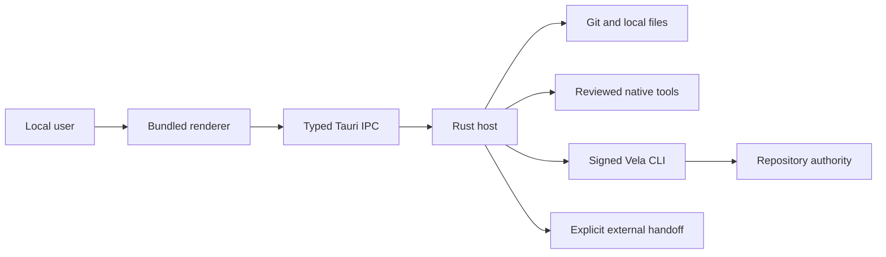

# Vela Workbench Tranche 3 AppSec threat model

## Executive summary

Vela Workbench is a single-user macOS Tauri app whose Rust host crosses local filesystem, subprocess, evidence, signer and Repository-authority boundaries. The highest risks are substituted executable/evidence bytes, stale or confused authority intent, signer exposure, and a committed Decision hidden by a failed receipt. Controls are closed typed IPC, canonical paths, exact Vela hash gating, bounded cleared child environments, post-confirmation plan equality, exact `entry_root`, structured errors, and immediate replay/readback.

## Scope and assumptions

In scope: `src-tauri/src/commands`, `src-tauri/src/ports`, `src-tauri/src/contracts`, Tauri capability/CSP, generated bindings, and the five renderer surfaces. Runtime is local, single-user, bundled-only and macOS arm64, with no listener or remote WebView. Repositories, evidence, envelopes and renderer inputs are untrusted. Signed Vela v0.977.3 and an explicitly available SSH agent are trusted only through closed commands. Mutating tests use disposable Repositories. Web, Core, providers, real scientific state, release infrastructure and Linux/BSD distribution are out of scope.

The user supplied deployment, exposure, authority, sensitivity and non-goal context, so no unresolved service-context question blocks this model. Re-rank if the app becomes multi-user, accepts remote content, gains generic IPC, or distributes on another platform.

## System model

### Primary components

- React renderer: presentation and typed requests (`src/App.tsx`, `src/TrancheThree.tsx`).
- Tauri ACL: one local capability and 29 enumerated handlers (`src-tauri/capabilities/main.json`, `src-tauri/permissions/workbench.toml`).
- Rust host: validation, confirmations and process-local state (`src-tauri/src/commands/mod.rs`).
- Fixed ports: Git, Vela, NativeExec, evidence, launch and Entire (`src-tauri/src/ports`).
- Rust preferences: clearable recent repository/tool paths (`src-tauri/src/preferences.rs`).

### Data flows and trust boundaries

- User → renderer → Rust: typed IPC; Rust rebuilds plans and ignores renderer authority claims.
- Repository/files → Rust: native-selected canonical paths, regular-file/bounds/hash/Git checks.
- Rust → Git/native tools: OS argv, fixed profiles, cleared environment, bounded output/time/process group; not a sandbox.
- Rust → Vela: hash-pinned binary and closed JSON argv. Only Decision forwards `SSH_AUTH_SOCK`; Vela owns authentication, policy and signing.
- Rust → renderer: generated validated DTOs, never raw signer secrets or unparsed subprocess JSON.
- Rust → external app: explicit canonical path or sanitized HTTPS locator.

#### Diagram

## Assets and security objectives

| Asset | Why it matters | Security objective |
| --- | --- | --- |
| Repository source and Git refs | sovereign work and revision identity | integrity, availability |
| Evidence and private files | unpublished science or secrets | confidentiality, integrity |
| SSH agent and authority policy | can authorize scientific-state mutation | confidentiality, integrity |
| Vela canonical state | Submission, Verification, Decision, Event, Standing | integrity, availability |
| Preview/confirmation intent | binds the approved exact operation | integrity |
| Renderer DTOs and receipts | must separate evidence, Verification and Standing | integrity |
| Preferences | disclose local paths but must be deletable | confidentiality, availability |

## Attacker model

### Capabilities

An attacker may control a selected repository, Git configuration, Method/evidence/envelope bytes, renderer request values, native-tool output and concurrent same-user filesystem changes. Repository-native tools may execute arbitrary code with current-user privileges after explicit initiation.

### Non-capabilities

There is no assumed remote network entry point or compromise of the signed Vela release. Workbench does not isolate against an attacker who already controls the user account and approvals.

## Entry points and attack surfaces

| Surface | How reached | Trust boundary | Notes | Evidence |
| --- | --- | --- | --- | --- |
| 29 private commands | bundled renderer invoke | renderer to Rust | closed DTOs and ACL | `src-tauri/src/lib.rs`; `src-tauri/permissions/workbench.toml` |
| Repository/evidence | native dialogs | filesystem to Rust | canonical, contained, bounded | `src-tauri/src/commands/mod.rs`; `src-tauri/src/ports/evidence.rs` |
| Git operations | fixed system Git | repo config to process | filters refused; review files clean at HEAD | `src-tauri/src/ports/git.rs` |
| Native execution | explicit profile | repo code to user account | bounds only, not sandboxing | `src-tauri/src/ports/native_exec.rs`; `src-tauri/src/ports/process.rs` |
| Vela JSON | selected executable | process to host | hash before/after, schema/semantic validation | `src-tauri/src/ports/vela.rs`; `src-tauri/src/ports/tranche_three.rs` |
| Decision | native confirmation | user and SSH agent to Vela | exact entry root and readback | `src-tauri/src/commands/mod.rs`; `src-tauri/src/ports/tranche_three.rs` |

## Top abuse paths

1. Replace Vela or evidence, then induce authority execution. Hash and post-confirmation equality refuse substitution.
2. Change Proposal/Verification state after preview. Fresh reads and exact `--if-entry-root` refuse staleness.
3. Use actor count to imply independence. DTOs preserve declared/shared dependencies and present no score.
4. Substitute Method/output bytes. Containment, tracked clean-at-HEAD checks, roots and plan equality refuse it.
5. Execute configured worktree filters. Target-tree attributes are inspected and any `filter` is refused.
6. Leak signer credentials to generic processes. Only the closed Decision receives the SSH agent socket.
7. Commit a Decision but suppress its receipt. Immediate replay/show marks committed state and says not to retry.
8. Forge a stable error through prose. Rust branches only on `vela.error.v1` kind/code.

## Threat model table

| Threat ID | Threat source | Prerequisites | Threat action | Impact | Impacted assets | Existing controls | Gaps | Recommended mitigations | Detection ideas | Likelihood | Impact severity | Priority |
| --- | --- | --- | --- | --- | --- | --- | --- | --- | --- | --- | --- | --- |
| TM-001 | hostile repo/same user | mutable selected paths | substitute executable/evidence | wrong action | source, evidence, state | canonicalization, hashes, equality | same-user TOCTOU | keep post-checks fail-closed | substitution tests | medium | high | high |
| TM-002 | concurrent writer | reviewed Proposal | change entry before Decision | stale authority action | authority state | fresh reads, entry root | confirmation window | never retry stale Decision | stale-root gate | medium | high | high |
| TM-003 | misleading metadata | shared reviewer dependencies | present votes as independent | bad judgment | verification interpretation | explicit facets, no scores | disclosure can be dishonest | retain scoped nonclaims | dependency UI tests | medium | high | high |
| TM-004 | receipt failure | Decision may commit | hide commit and induce duplicate | duplicate/refused action | Vela state | replay/show, committed flag | readback may fail | require manual CLI if both fail | fault injection | low | high | medium |
| TM-005 | repository code | explicit native start | access files/network/mutate | local compromise | user account/data | exact warning, fixed argv/env/bounds | no sandbox | keep profile-specific initiation | process tests | medium | high | high |
| TM-006 | renderer compromise | bundled app compromised | invoke privilege | local/state compromise | all | CSP, ACL, exact handlers | allowed DTOs remain privileged | independent ACL review | config hashes | low | high | medium |
| TM-007 | malicious JSON | selected input | exhaust/spoof dialog | denial/wrong intent | availability/intent | bounds, escaping, schemas | future novelty | versioned fixtures | malformed tests | low | medium | low |
| TM-008 | local remanence | viewed evidence | retain after clear | privacy loss | private evidence | process-local maps, clear generation | memory not zeroized | document exit boundary | deletion tests | low | medium | low |

## Criticality calibration

- Critical: remote or unconfirmed authority execution, signer extraction, or generic renderer RCE.
- High: stale/wrong Decision, unacknowledged current-user code execution, or private evidence exfiltration.
- Medium: committed receipt ambiguity recovered by readback, constrained capability drift, or local denial.
- Low: bounded malformed-input denial or coarse path disclosure requiring same-user control.

## Focus paths for security review

| Path | Why it matters | Related Threat IDs |
| --- | --- | --- |
| `src-tauri/src/commands/mod.rs` | selection, equality, confirmation, recovery | TM-001, TM-002, TM-004, TM-008 |
| `src-tauri/src/ports/tranche_three.rs` | Vela parsing and authority readback | TM-002, TM-003, TM-004, TM-007 |
| `src-tauri/src/ports/process.rs` | environment and process tree | TM-005 |
| `src-tauri/src/ports/git.rs` | hostile repo config and roots | TM-001, TM-005 |
| `src-tauri/src/ports/vela.rs` | executable identity | TM-001, TM-007 |
| `src-tauri/capabilities/main.json` | renderer privilege | TM-006 |
| `src/TrancheThree.tsx` | semantic separation | TM-003, TM-004 |

## Quality check

- All discovered runtime entry points and trust boundaries are covered.
- Runtime behavior is separate from packaging and disposable tests.
- User-supplied local-only, macOS-only and authority assumptions are explicit.
- Unknown schemas fail closed; same-user and non-sandbox residuals remain visible.
